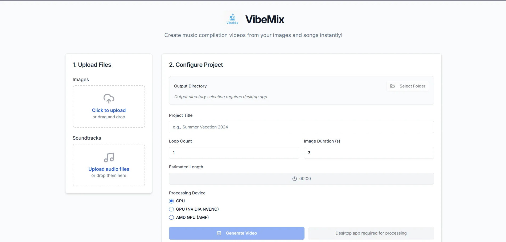

<div align="center">

# VibeMix

A desktop application for creating video slideshows from images with merged audio tracks



</div>

## Overview

VibeMix is a desktop application that converts your images and audio files into professional video slideshows. This will result music compilation video with images slideshow. Also songs list with timestamp will provided for video description. The app uses FFmpeg for video processing and provides both CPU and GPU acceleration options.

## Download

See Releases for the Windows (Portable), Linux, and Mac latest version: [VibeMix Releases](https://github.com/jo0707/vibemix/releases)

## Technical Stack

-   **Frontend**: Next.js 15
-   **Desktop**: Electron
-   **Styling**: Shadcn/UI
-   **Package Manager**: Bun / Yarn for build
-   **Video Processing**: FFmpeg with CPU/GPU acceleration

## Installation

### Prerequisites

-   FFmpeg (automatically checked and guided installation)
-   Node.js 20 or higher
-   Bun package manager

### Setup

```bash
# Clone the repository
git clone https://github.com/jo0707/vibemix.git
cd vibemix

# Install dependencies
bun install

# Start development server
bun run electron:dev

# Build for production
bun run electron:build
```

## Usage

### Basic Workflow

1. Launch the desktop application
2. Select or confirm output directory (saved automatically)
3. Upload image files (PNG, JPG, JPEG)
4. Upload audio files (WAV, MP3)
5. Configure project settings (title, duration, loops, processing device)
6. Click "Generate Video" to start processing
7. Monitor progress in separate terminal window
8. Access completed video via "Open Output Directory" button

## Contributing

Feel free to contribute by submitting issues or pull requests. For major changes, please open an issue first to discuss what you would like to change.
